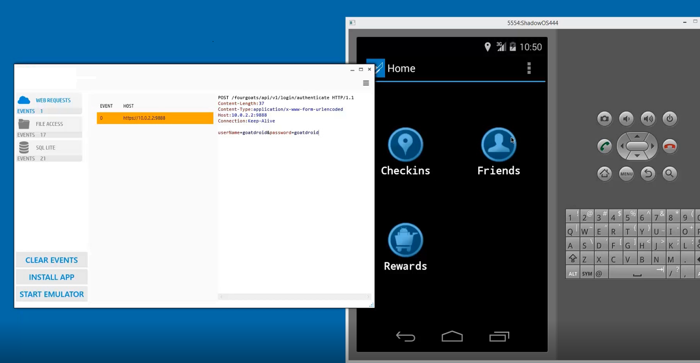

# ShadowOS
Android application security tool

Testing mobile applications for security vulnerabilities is a difficult job.  There are many target areas to analyze and much of it is manual.   ShadowOS is a tool to help security testers evaluate mobile applications for vulnerabilities.   It is a custom created Android OS that intercepts events and displays them in a console. The captured events are relevant to a mobile pen test and makes in depth app analysis easier.  These application events include:

File System - All reads and writes to the file system

Local Database Access - select, insert, update statements and parameters

Device Internet Requests - This includes HTTP and HTTPS traffic.  Since this is a custom OS, the HTTPS traffic is captured before encryption

# Emulator
ShadowOS is runs in an emulator for quick and easy testing of applications. The image is based on Android 9.0 Pie.

# Output
ShadowOS logs all events to the adb console.   Each event will have a tag of "ShadowOS" and the type of event with relevant information. Below you can see how events where captured while exercising the OWASP GoatDroid application.

Tools can also be created for viewing the data

